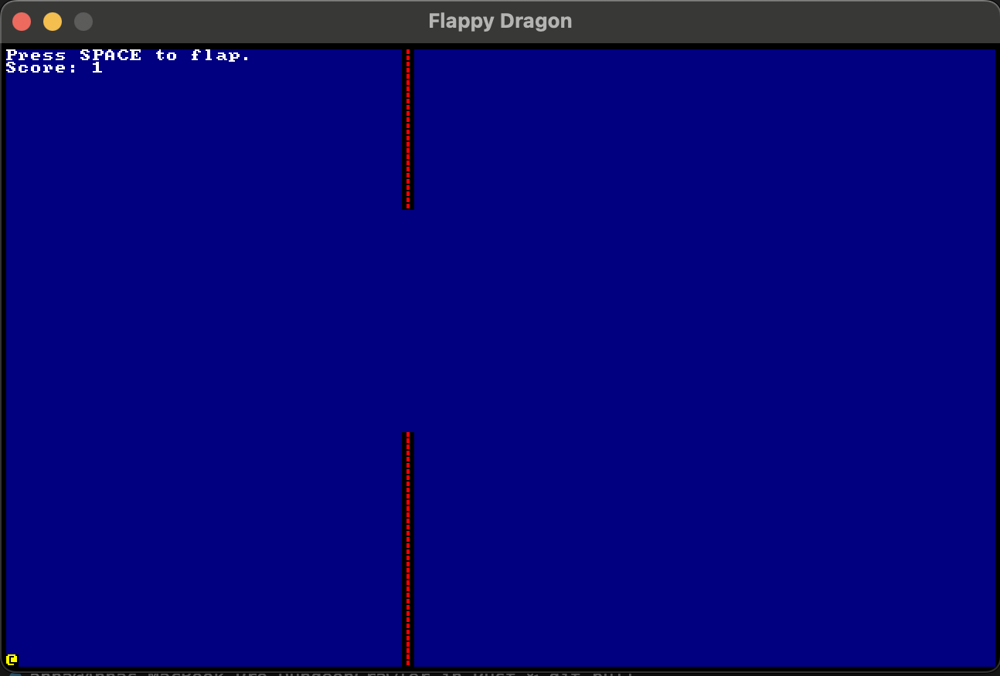

# Flappy Dragon
Flappy Dragon is a simple, retro-style game written in Rust using the Bracket-lib game engine. In this game, players navigate a dragon through obstacles by flapping its wings to avoid crashing. This project is built with high standards for clarity and simplicity, taking advantage of Rust’s strong type system and the clip linter for optimized code quality.

## Features

	•	Simple and addictive gameplay inspired by the classic “Flappy Bird.”
	•	Retro ASCII art visuals.
	•	Adjustable gravity and velocity mechanics for more engaging player control.
	•	Randomized obstacle positioning to keep each playthrough unique.
	•	Menu and game-over screens for enhanced user experience.

## Requirements
To play or modify this game, you’ll need:
•	Rust installed on your system.
•	The bracket-lib crate, which can be installed via Cargo.

### Getting Started
```
git clone https://github.com/annasudol/DungeonCrawler_in_Rust.git
cd DungeonCrawler_in_Rust
```

### Build and run the program

```aiignore
cargo run
```

### Controls

* Spacebar: Flap the dragon’s wings to rise.
* Start a new game from the main menu or restart after game over.
* Q: Quit the game.


## Code overview

* Player struct: Manages the player’s position, gravity, and movement.
* Obstacle struct: Handles obstacle creation, rendering, and collision detection.
* State struct: Maintains game state, including the main game loop, score tracking, and screen management.
* Game Modes: Three primary modes (Menu, Playing, and End) define game states.


## Game Screenshots



## License

This project is licensed under the Anna Sudol License - see the LICENSE.md file for details
